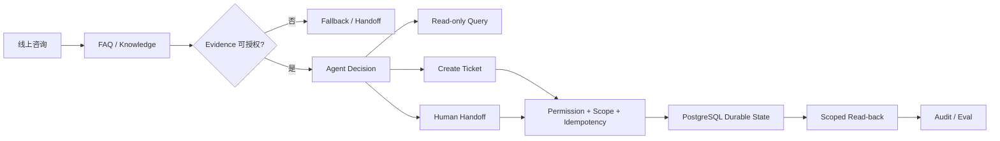

# 数字前台 Agent · Pre-ICP Frozen Integrated Baseline

> **面向小型门店 / 服务型商家的线上第一接待 Agent 工程。**  
> 从“能聊天”继续推进到 **Evidence 可追溯、Tool 有权限边界、业务动作可持久化、异常可转人工、版本可评测、系统可复现交付**。

**Integrated baseline：Agent Runtime + server-derived Authority + AgentProfile + Durable Acceptance + Governed Knowledge + PostgreSQL + React + Docker + FastAPI / pgvector + Eval Governance**  
**Pre-ICP frozen source：`55182eb11e801b49a5c5564d05acc72207b249f1` · clean-runner `35238937264` PASS**  
**不声称：Production Ready / 真实客户部署 / Hosted Embedding PASS / Retrieval Quality Acceptance / Live WeCom**

---

## 30 秒看懂这个项目

这个项目不是通用 Chatbot，也不是为了堆技术栈。

它围绕一个真实问题展开：

> **如果一个 Agent 要进入线上接待 / 客服业务，它凭什么回答、谁允许它执行动作、业务状态是否真的发生、失败后如何收口、版本改变以后怎么知道是变好了还是变坏了？**

最终形成的工程链路：

**线上咨询 → Governed Evidence → Agent Decision → Authorized Tool → Durable Ticket / Handoff → Eval / Audit → Docker / Integration**

| 招聘官关心的问题 | 工程回答 |
| --- | --- |
| 模型为什么可以回答？ | FAQ / Knowledge 先经过 approval、version、source-reference、tenant/store scope admission |
| 模型说要执行动作，就真的能执行吗？ | 不能；服务端解析 identity / membership / capability / scope 后决定是否允许 |
| Tool Call 就代表业务成功了吗？ | 不代表；Ticket / Handoff 需要持久化并通过 scoped read-back 证明 |
| 不同租户会不会串数据？ | tenant/store authority 与 PostgreSQL isolation 有独立 Gate |
| Agent / Provider / Tool 卡住怎么办？ | Turn / Tool Budget、整体 / 单 Tool Timeout、cancellation、controlled fallback |
| 版本修改后怎么验证？ | Runtime regression、Safety evaluation、blind holdout、Knowledge / Retrieval eval、CI Gate |
| Demo 怎么走向可交付？ | 同源 React + Node API + PostgreSQL + Docker；RAG 支线加入 private FastAPI + pgvector 的 deterministic integration proof |

---

## 当前主干收口范围

当前主干收敛到已经独立验证的 **Pre-ICP frozen engineering baseline**。实现语义以冻结源
`55182eb11e801b49a5c5564d05acc72207b249f1` 为准；历史 / 实验分支继续保留为 provenance，
不再形成第二个“当前事实中心”。

主干集成后覆盖：

- **Agent Runtime**：Pi-owned Agent loop；产品侧控制 Tools、Evidence、Safety、Session / Audit。
- **Request Debugging**：server-side `requestId` 贯穿 HTTP → execution context → Runtime → audit，便于精确关联一次请求。
- **AgentProfile**：服务端版本化 profile 约束 Skills / Tools / identity/work policy；profile identity/hash 进入执行与审计边界。
- **Safety / Eval**：Safety vertical slice、100-case robustness、60-case blind holdout，以及历史 Knowledge / Retrieval evaluation。
- **Knowledge Governance**：FAQ / Knowledge 的 approval、version、source reference 与 tenant/store scope admission。
- **Authority / Persistence**：server-derived identity / capability / scope；PostgreSQL durable Ticket / Handoff / Audit。
- **Durable Acceptance**：Harness 区分模型/Tool 声称与权威业务结果，使用 scoped durable read-back 验证 Ticket / Handoff 最终状态。
- **Evaluation Governance**：descriptive governance manifest、thin regression matrix、report-only MRR / difficulty breakdown；既有 evaluator 仍是唯一 PASS/FAIL authority。
- **Product Surface**：同源 React shell / StoreOps views。
- **Delivery**：Docker / Compose 的本地可复现交付与 restart-persistence proof。
- **RAG Integration**：private Python / FastAPI retrieval service + PostgreSQL 16 / pgvector + Node canonical reconciliation 的 deterministic integration proof。
- **CI / Gate**：PostgreSQL、Python、Node、React、Docker、cross-language E2E 与 Eval suites 的 clean-runner evidence。

仍然明确不在当前主干闭环中的包括：

- public HTTPS / ICP 后的公网部署；
- live WeCom wire integration；
- production Data Flywheel；
- thin MCP；
- Semantic Selector 的历史真实模型实验与 latency characterization；
- 其他 failed / blocked / exploratory checkpoints。

这样让 **main 表示当前唯一的 Pre-ICP engineering baseline**；历史分支只保留演进、实验、失败与阶段性证据。

---

## 一条业务链，而不是一个聊天框



核心判断始终保持：

- **Retrieval ≠ Answer Authorization**
- **LLM Proposal ≠ Server Authorization**
- **Tool Call ≠ Durable Business Success**
- **Text ≠ Business State**
- **Eval PASS ≠ Production Ready**

---

## Recruiter Quick View

| 能力 | 可验证工程证据 |
| --- | --- |
| **Agent Runtime** | 真实 Pi Agent loop、4 个受控业务 Tool、turn / tool budget、timeout / cancellation |
| **Request Traceability** | server-derived `requestId` 跨 HTTP / execution / Runtime / audit 关联，不接受客户端自声明 authority |
| **AgentProfile Governance** | 版本化 profile + canonical hash；Skills / Tools 只能收窄 operator authority，profile mismatch fail closed |
| **Evidence-first** | Governed FAQ / Knowledge admission；0 / 1 / 2+ answerability；没有合法 Evidence 时 fail closed |
| **Tool / Authority** | server-derived identity、membership、capability、tenant/store scope；LLM 不直接拥有写权限 |
| **Durable Acceptance** | Tool/model claim 不等于业务成功；Ticket / Handoff 要通过 PostgreSQL scoped durable observation 才能验收 |
| **Eval Governance** | 现有 Safety / Knowledge / Retrieval / Harness 结果由 governance manifest 描述、regression matrix 聚合；无 blended Agent score |
| **Delivery / Integration** | React + Node + PostgreSQL + Docker；private FastAPI / pgvector deterministic cross-language integration |
| **Engineering Trade-off** | Semantic Selector 因质量 / 时延 / contract 问题未被硬塞进主路径，失败证据保留在历史分支 |

---

## 关键工程机制

### 1. Governed Evidence

FAQ / Knowledge 不因为“检索到了”就自动获得答复资格。

Evidence 会经过：

- approval lifecycle
- version
- source reference
- tenant / store scope
- synthetic / test admission boundary

普通 Knowledge 使用明确的 **0 / 1 / 2+** 路由：

- 0 个 admissible candidate → fallback
- 1 个 canonical candidate → answer eligible
- 2+ candidates → ambiguous / fallback

### 2. Tool / Authority

业务写操作不由模型直接授权。

服务端负责：

- identity / membership
- capability
- tenant / store authority
- Ticket / Handoff permission
- durable business write

LLM 只负责理解场景并提出下一步动作。

### 3. Durable Side Effects

Ticket / Handoff 不以模型文本或单次 Tool Call 作为成功证明。

关键动作需要：

**authorize → write → persistence → scoped read-back**

同时保留：

- idempotency
- duplicate / race protection
- tenant/store isolation
- safe audit projection

### 4. Runtime Budget / Failure Handling

Runtime 保留明确预算：

- Agent turns：4
- Tool calls：6
- Overall turn timeout：10s
- Per-tool timeout：2s

超时、provider failure、tool failure、evidence failure、权限不足都进入 bounded failure path，而不是让 Agent 无限继续执行。

### 5. Eval / Gate

项目不是只修单个 Badcase。

质量链路包括：

**Case / Config → Runtime → Evaluation → Report → Gate → Version Decision**

现有 evaluator 的 PASS / FAIL 语义保持权威；Pre-ICP consolidation 只增加：
- descriptive governance manifest；
- thin unified regression matrix；
- report-only MRR / difficulty breakdown；
- Architecture Expansion / Ablation governance。

它们用于提高可解释性和回归可见性，不创建新的生产质量声明，也不制造单一 blended Agent score。

---

## Pre-ICP 冻结证据

当前实现语义的冻结源：

- Source commit：`55182eb11e801b49a5c5564d05acc72207b249f1`
- Source tree：`68499338168aed05353247ce5196503b7118bcf7`
- Clean-runner：`35238937264`
- Job：`105262039153`
- Conclusion：**success**

该 frozen source 在 Job-Search Sprint V1 之上进一步关闭：

- Request Debugging；
- Durable Acceptance；
- Thin Digital Employee / AgentProfile；
- Pre-ICP Evaluation Governance Consolidation V1。

这仍然是工程 / 集成证据，不等于公网部署、真实 WeCom 流量、production Data Flywheel、
production-calibrated retrieval quality 或 Production Ready。

---

## Job-Search Sprint V1 · 历史稳定证据

冻结的 Sprint closure 记录：

- Final reconciled closure baseline：`0a2d0f723814eb787e079195dc4326a944c1fd76`
- Final clean-runner：`34766236491`
- Conclusion：**success**

Clean-runner 覆盖的已验证能力包括：

- PostgreSQL migrations 001–005
- Identity / Business / Application gates
- Core A / Core B PostgreSQL gates
- Tenant / store isolation
- Python RAG：43 / 43
- vector-postgres cross-language E2E
- React application
- Docker build / start / persistence
- build / check / integrity
- historical Safety / Knowledge / Retrieval evaluation suites

这里的 **deterministic vector / pgvector / FastAPI / Node integration PASS** 表示集成正确性，不等于 hosted embedding 或 semantic retrieval quality 已通过验收。

---

## RAG / FastAPI 支线

在 Job-Ready 集成中，Python 服务被设计为 **private Candidate Evidence service**：

- Python 3.11 / FastAPI
- Pydantic strict contracts
- PostgreSQL / pgvector
- service credential
- bounded request / response
- cancellation / timeout
- tenant/store/version/profile filtering
- Node canonical registry reconciliation

边界保持：

> **Python 可以返回 Candidate Evidence，但不能自行批准 Knowledge、扩大 Scope、改变业务状态或直接决定最终回答。**

Lexical retrieval 仍是默认路径；vector mode 为显式 opt-in。

---

## 技术栈

- **TypeScript / Node.js**
- **React**
- **PostgreSQL 16**
- **pgvector**
- **Python 3.11 / FastAPI**
- **psycopg**
- **Vitest**
- **TypeBox**
- **Pydantic**
- **Docker / Compose**
- **GitHub Actions**
- **Pi Agent Core / Pi AI / Pi Coding Agent**

---

## 主要目录

```text
src/
  index.ts                    # Agent Runtime / Tools / Guards
  enterprise/                 # identity / authority / business / HTTP / PostgreSQL

web/                          # React product surface
ai-service/                   # private FastAPI Candidate Evidence service
migrations/                   # PostgreSQL schema / ledger / RAG profile
evals/                        # Safety / Knowledge / Retrieval + governance / regression aggregation
skills/                       # product-owned business Skills
tests/                        # runtime / enterprise / PostgreSQL / integration tests
scripts/                      # Docker / Gate / delivery verification
Dockerfile
compose.yaml
```

---

## 为什么保留失败实验

这个仓库刻意不把所有实验都包装成成功。

例如 Semantic Evidence Selector 做过真实模型、unseen holdout、order robustness 与 latency characterization；其中 30 次历史时延观测得到：

- P50 ≈ **7.35s**
- P95 ≈ **16.67s**

这不满足当前同步主链的整体 / 单 Tool 时延预算，因此没有把它硬塞进 Runtime 主路径。

历史分支仍然保留这些 Failed / Blocked / Deferred 证据，用来解释：

> **为什么最终架构选择了当前方案。**

---

## 当前明确不声称

- **Production Ready**
- **真实客户部署 / Pilot 已验收**
- **Production SLA / 大规模真实流量**
- **Hosted OpenAI Embedding PASS**
- **Semantic / Vector Retrieval Quality Acceptance**
- **Hybrid / RRF 已实现**
- **Reranker 已上线**
- **Live WeCom protocol / identity wiring**
- **Public HTTPS / domain hosting**
- **MCP 已进入当前产品主链**
- **复杂 CRM / ERP 生产集成**

这些属于后续真实部署 / POC 或 successor roadmap，不从当前代码证据中提前推断。

---

## 历史 / successor 分支

如果需要继续审查工程决策：

- [V1 Safety](https://github.com/wanghanyu654321-cell/-agent/tree/feat/v1-safety-vertical-slice)
- [V1.2 Blind Eval / CI](https://github.com/wanghanyu654321-cell/-agent/tree/feat/v1.2-blind-eval-ci)
- [V2 Knowledge Governance](https://github.com/wanghanyu654321-cell/-agent/tree/feat/v2.0-knowledge-grounding)
- [V2.1 Retrieval](https://github.com/wanghanyu654321-cell/-agent/tree/feat/v2.1-real-knowledge-retrieval)
- [V2.3 Semantic Selector](https://github.com/wanghanyu654321-cell/-agent/tree/feat/v2.3-semantic-evidence-selector)
- [Job-Search Sprint V1](https://github.com/wanghanyu654321-cell/-agent/tree/job-search/sprint-v1)
- [FastAPI / RAG Core B](https://github.com/wanghanyu654321-cell/-agent/tree/job-ready/core-b-fastapi-rag-v1)
- [Integration V1](https://github.com/wanghanyu654321-cell/-agent/tree/job-ready/integration-v1)
- [Request Debugging closure](https://github.com/wanghanyu654321-cell/-agent/tree/job-ready/request-debugging-closure-v1)
- [Harness / Acceptance successor](https://github.com/wanghanyu654321-cell/-agent/tree/job-ready/harness-acceptance-extension-v1)
- [Thin Digital Employee / Pre-ICP frozen source](https://github.com/wanghanyu654321-cell/-agent/tree/job-ready/thin-digital-employee-v1)

> **Main 是当前唯一的 Pre-ICP authoritative engineering baseline；分支保留 provenance、阶段性 closure、实验与失败证据。**
