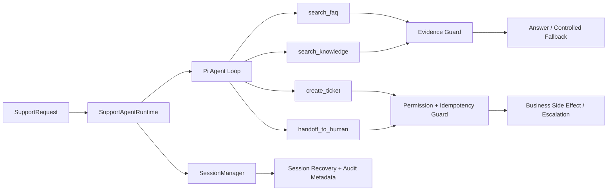

# 数字前台 Agent · Support Runtime V0

> 面向线上第一接待 / 客服场景的独立 Agent Runtime 工程切片。  
> 重点不是“做一个能聊天的 Bot”，而是验证 **Evidence、Authority、Side Effect、Handoff、Timeout、Session / Audit** 这些真正决定 Agent 能否进入业务流程的工程边界。

## Recruiter Quick View

这个仓库主要证明 5 件事：

| 能力 | 工程证据 |
| --- | --- |
| Agent Runtime | 基于公开 Pi Agent API 运行真实 Agent loop，而非手写模拟状态机 |
| Evidence-first | FAQ / Knowledge 无可靠证据时 fail closed，不允许模型自由猜答 |
| Tool / Authority | 写操作由服务端权限判断控制，LLM 只能提出动作，不能自行获得授权 |
| Safe Side Effects | Ticket / Handoff 有严格 schema、幂等与并发重复保护 |
| Quality Gate | 41 个自动化测试覆盖 runtime、session、权限、超时、fallback、race 与 extraction independence |

**当前状态：Runtime V0 已冻结并通过独立安装 / 测试验证。**  
该仓库刻意不包含 UI、向量数据库、渠道适配器、多 Agent、生产环境部署或真实客户数据；这些能力不应从当前代码中推断。

---

## 1. 为什么做这个 Runtime

客服 / 数字前台 Agent 真正难的不是生成一句自然语言，而是回答下面这些问题：

1. **检索到了信息，是否就有资格回答？**
2. **模型提出“创建 Ticket / 转人工”，是否就有权执行？**
3. **模型说“已经完成”，业务动作是否真的发生？**
4. **Tool 卡住、Provider 失败、Agent 循环过长时，系统如何安全退出？**
5. **多轮会话恢复以后，tenant / store / customer 身份是否仍然一致？**

因此 V0 的设计目标不是堆功能，而是先把 **Evidence → Decision → Authorized Tool → Side Effect / Handoff → Audit** 这条最小闭环做正确。

---

## 2. Runtime 架构



核心原则：

- **Retrieval ≠ Answer Authorization**：没有经过验证的 FAQ / Knowledge Evidence，不输出业务事实答案。
- **LLM Proposal ≠ Server Authorization**：Ticket / Handoff 在 Tool 执行前检查权限。
- **Text ≠ Business State**：模型文本不能单独证明“已退款 / 已取消 / 已完成”等副作用已经发生。
- **Fail Closed**：Evidence 缺失、Tool 失败、权限不足、超时、Agent / Tool Budget 达上限时，返回受控 fallback 或人工升级。
- **Identity Bound Session**：同一 conversation 恢复时校验 tenant / store / customer，避免跨身份复用 Session。

---

## 3. 关键工程机制

### Evidence Guard

`search_faq` 与 `search_knowledge` 都是只读 Tool。Runtime 会记录是否得到经过验证的 Evidence；如果回答包含营业、退款、预约、订单、价格、政策等业务事实，但当前 turn 没有 Evidence 支撑，则直接 fallback。

### Tool / Authority

当前唯一有副作用的 Tool：

- `create_ticket`
- `handoff_to_human`

执行前由 Runtime 检查权限：

- Ticket：`tickets:write`
- Handoff：`handoff:write` + `mayEscalate`

Tool 参数全部使用 TypeBox strict schema，拒绝额外字段。

### Idempotency & Concurrency

Ticket 使用 `tenantId + idempotencyKey` 防重复；Ticket 与 Handoff 都增加 reservation，避免并发调用在真正写入前出现 race condition。

### Runtime Budget & Timeout

默认约束：

- Agent turns：4
- Tool calls：6
- Overall turn timeout：10s
- Per-tool timeout：2s

Timeout 使用 `AbortSignal` 向 Retrieval / Tool 传播取消，并隔离 late events，避免超时以后仍产生不可控副作用。

### Session & Audit

通过 Pi `SessionManager` 保存 / 恢复对话上下文，并额外写入 `support-agent.audit`：

- outcome
- toolsCalled
- turns
- toolCalls
- timedOut
- limitReached
- escalationRequested
- toolFailed

这使 Runtime 不只返回结果，也保留一次 Agent 执行为什么结束的审计信息。

---

## 4. 自动化验证

仓库当前验证结果：

```text
Vitest: 41 / 41 PASS
Build: PASS
Biome + Type Check: PASS
Clean install verification: PASS
```

覆盖范围包括：

- Session recovery / identity consistency
- 4 个业务 Tool 的 schema 与执行
- Tool permission guard
- Ticket / Handoff 幂等与并发 race
- Agent / Tool budget
- Overall / per-tool timeout 与 cancellation
- Provider failure fallback
- Empty / unsafe model output guard
- No-evidence / FAQ hallucination guard
- Audit persistence
- Extraction independence / exact dependency pins

验证命令：

```bash
npm ci
npm test
npm run build
npm run check
```

---

## 5. 技术栈

- **TypeScript / Node.js 22+**
- **Vitest**
- **TypeBox**
- **Biome**
- **Pi Agent Core / Pi AI / Pi Coding Agent**
- JSONL Session persistence（Pi SessionManager）

依赖固定在明确版本，不使用 floating branch / tag，也没有 vendored Pi core 源码。

---

## 6. 仓库结构

```text
src/
  index.ts                         # Runtime、4 个业务 Tool、guards、session / audit

skills/
  appointment/
  complaint/
  escalation/
  greeting/
  refund/                          # 产品侧业务 SOP / Skill

tests/
  support-agent-runtime.test.ts    # V0 runtime 主测试集
  extraction-independence.test.ts  # 独立仓库与依赖边界验证

docs/
  support-agent/
    ARCHITECTURE.md
    CURRENT_STATE.md
    TEST_REPORT.md
  architecture/
    PI_INTEGRATION.md
  extraction/
    EXTRACTION_MANIFEST.md
    EXTRACTION_GATE_REPORT.md
```

---

## 7. 设计边界

这个仓库是一个**刻意收敛的 Runtime V0**。当前没有声称已经实现：

- Vector DB / Embedding RAG
- UI / Web / Mini Program
- CRM / ERP 等真实企业系统集成
- 多 Agent orchestration
- 真实客户生产部署
- 生产 SLA / 大规模流量验证

V0 的目的，是先把 Agent 进入真实业务流程之前最容易出问题的 **Evidence、Authority、Side Effect、Session、Timeout 与 Audit** 做成可测试、可审查的工程基线。

---

## 8. 延伸阅读

- [Runtime Architecture](docs/support-agent/ARCHITECTURE.md)
- [Current State](docs/support-agent/CURRENT_STATE.md)
- [Test Report](docs/support-agent/TEST_REPORT.md)
- [Pi Integration](docs/architecture/PI_INTEGRATION.md)
- [Extraction Manifest](docs/extraction/EXTRACTION_MANIFEST.md)
