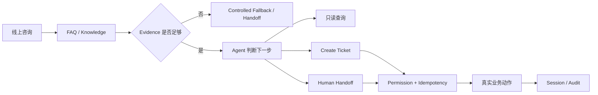
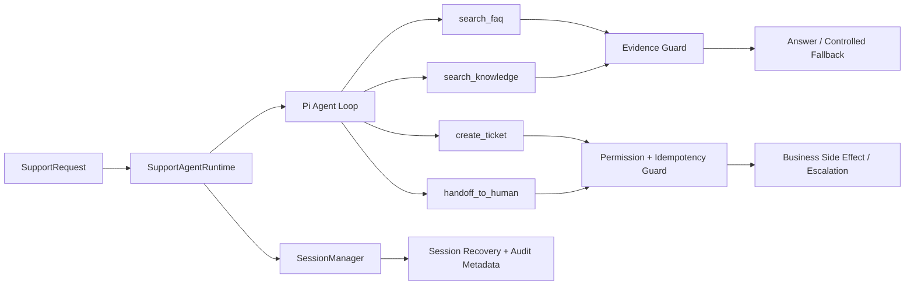

# 数字前台 Agent · Support Runtime V0

> **面向小型门店 / 服务型商家的线上第一接待 Agent Runtime 工程。**  
> 从“能聊天”继续推进到 **有依据地回答、受控地调用工具、真实地记录业务动作、必要时稳定转人工**。

**Main：Runtime V0 Frozen｜41 / 41 Tests PASS｜Build / Type Check / Clean Install PASS**  
**Branch work：Safety / Eval → Governed Knowledge → PostgreSQL / React / Docker → FastAPI / pgvector / Integration**

> **阅读说明**：`main` 是冻结的 V0 基线；后续能力保留在独立分支中。下文会明确区分 **已通过 Gate、实现候选、实验未通过、尚未进入 Runtime**，不会把“分支存在”写成“主干已发布”或“生产已上线”。

---

## 30 秒看懂这个项目

这个仓库不是完整 CRM，也不是一个通用 Chatbot。它围绕“数字前台 Agent”持续验证一条更实际的业务链：

**线上咨询 → Evidence → Agent Decision → Authorized Tool → Ticket / Handoff → Durable State → Eval / Audit**

| 招聘官关心的问题 | 工程回答 |
| --- | --- |
| 模型为什么可以回答？ | FAQ / Knowledge 必须有可验证 Evidence；没有依据就 fail closed |
| 模型说要创建 Ticket，就能执行吗？ | 不能。写操作必须经过服务端 Permission / Scope 判断 |
| 模型说“已完成”，业务动作真的完成了吗？ | 文本不等于业务状态；副作用必须由 Tool 真正执行并可验证 |
| 并发调用会不会重复创建？ | Ticket / Handoff 有幂等与 reservation，阻止重复和 race |
| Provider / Tool 卡住怎么办？ | Agent / Tool Budget + Overall / Per-tool Timeout + cancellation |
| 多轮恢复会不会串租户 / 串用户？ | Session 恢复时校验 tenant / store / customer identity |
| Agent 改了以后怎么证明更好？ | Runtime regression、Safety holdout、Knowledge / Retrieval eval、CI Gate |
| Demo 怎么继续走向可交付？ | 分支中继续验证 PostgreSQL persistence、React、Docker、FastAPI / pgvector 与完整 Integration |

---

## 工程演进不是都在 main：分支证据地图

这个项目采用“**冻结基线 + 独立验证分支**”推进。主干刻意保持稳定，新的 Safety、Eval、Retrieval、Delivery 能力先在独立分支通过 Gate，再决定是否进入后续集成。

| 阶段 | 分支 | 当前证据 / 结论 |
| --- | --- | --- |
| **V0 Runtime** | `main` | Pi Agent loop、4 个业务 Tool、Evidence / Authority / Side-effect Guard、Session / Audit；41 / 41 tests |
| **V1 Safety** | [`feat/v1-safety-vertical-slice`](https://github.com/wanghanyu654321-cell/-agent/tree/feat/v1-safety-vertical-slice) | 专业安全风险 evidence-gated；证据不足 / 部分命中时暂停并升级人工 |
| **V1.1 Robustness** | [`feat/v1.1-safety-robustness`](https://github.com/wanghanyu654321-cell/-agent/tree/feat/v1.1-safety-robustness) | 100-case runtime-derived evaluation：required escalation recall 100%，unsupported professional-claim rate 0%，duplicate handoff 0 |
| **V1.2 Blind Eval / CI** | [`feat/v1.2-blind-eval-ci`](https://github.com/wanghanyu654321-cell/-agent/tree/feat/v1.2-blind-eval-ci) | 独立 60-case blind holdout，含 hard-negative / adversarial cases，并进入 clean-runner CI Gate |
| **V2.0 Knowledge Governance** | [`feat/v2.0-knowledge-grounding`](https://github.com/wanghanyu654321-cell/-agent/tree/feat/v2.0-knowledge-grounding) | FAQ / Knowledge 统一进入 approval、version、source-reference、tenant/store-scope admission；Grounding 信息进入 result / audit |
| **V2.1 Retrieval Quality** | [`feat/v2.1-real-knowledge-retrieval`](https://github.com/wanghanyu654321-cell/-agent/tree/feat/v2.1-real-knowledge-retrieval) | 使用公开官方本地服务知识 + 脱敏场景做 bounded real-world retrieval benchmark；不冒充真实门店数据 |
| **V2.2 Evidence Selection** | [`feat/v2.2-evidence-selection`](https://github.com/wanghanyu654321-cell/-agent/tree/feat/v2.2-evidence-selection) | 确认当前 deterministic score 无法同时满足既定 correctness / coverage Gate，因此没有硬凑规则上线，而是记录“需要 semantic selection”的工程结论 |
| **V2.3 Semantic Selector** | [`feat/v2.3-semantic-evidence-selector`](https://github.com/wanghanyu654321-cell/-agent/tree/feat/v2.3-semantic-evidence-selector) | 做了真实模型离线 Gate、unseen holdout、order robustness 与 latency characterization；30 次时延观测 P50 ≈ 7.35s、P95 ≈ 16.67s，当前不满足同步主链预算，因此 **没有进入 Runtime 主路径** |
| **Enterprise / Delivery** | [`feat/phase-2c-docker-delivery`](https://github.com/wanghanyu654321-cell/-agent/tree/feat/phase-2c-docker-delivery) | Server-side identity / RBAC、tenant/store authority、PostgreSQL durable Ticket / Handoff / Audit、React shell、两服务 Docker delivery 已分别经过阶段 Gate |
| **Real Provider / Private Knowledge** | [`feat/pilot-real-source-runtime-proof`](https://github.com/wanghanyu654321-cell/-agent/tree/feat/pilot-real-source-runtime-proof) | Real Pi provider adapter 与 private store knowledge composition 已验证；real-source runtime proof 暴露过 cross-tool badcase 与 evidence-durability gap，因此未包装成“真实客户 Pilot 已通过” |
| **Job-Ready Integration** | [`job-search/sprint-v1`](https://github.com/wanghanyu654321-cell/-agent/tree/job-search/sprint-v1) | React + Node + PostgreSQL 16 / pgvector + private FastAPI retrieval + Docker 集成；S6 clean-runner 全回归成功。Deterministic vector integration PASS，但 hosted embedding 与 semantic retrieval quality acceptance 仍明确未宣称 |

### Job-Ready 专项分支

为便于按岗位验证能力，还保留了专项支线：

- [`job-ready/core-a-runtime-storeops-v1`](https://github.com/wanghanyu654321-cell/-agent/tree/job-ready/core-a-runtime-storeops-v1) — Runtime / StoreOps 边界。
- [`job-ready/core-b-fastapi-rag-v1`](https://github.com/wanghanyu654321-cell/-agent/tree/job-ready/core-b-fastapi-rag-v1) — Python 3.11 / FastAPI Retrieval Service、严格 HTTP contract、PostgreSQL adapter boundary；Python 29 tests，Node Core-B regression 44 passed / 1 skipped。
- [`job-ready/react-storeops-v1`](https://github.com/wanghanyu654321-cell/-agent/tree/job-ready/react-storeops-v1) — React StoreOps 展示面与受服务端 Scope 控制的业务视图。
- [`job-ready/eval-delivery-v1`](https://github.com/wanghanyu654321-cell/-agent/tree/job-ready/eval-delivery-v1) — Eval / Delivery 证据链与 Docker 可复现演示。
- [`job-ready/integration-v1`](https://github.com/wanghanyu654321-cell/-agent/tree/job-ready/integration-v1) — Core A / B + StoreOps + PostgreSQL + FastAPI 的集成候选。
- [`job-ready/harness-acceptance-extension-v1`](https://github.com/wanghanyu654321-cell/-agent/tree/job-ready/harness-acceptance-extension-v1) — Harness / Acceptance extension，继续把“能跑”转成“可验收”。

**这些分支证明的是工程演进和决策过程，不等于生产发布记录。**

---

## 它解决的不是“聊天”，而是这一条业务链



V0 聚焦四类受控业务 Tool：

- `search_faq`
- `search_knowledge`
- `create_ticket`
- `handoff_to_human`

其中前两类只读；后两类有副作用，必须经过权限、幂等和安全边界控制。

---

## 为什么要做这个 Runtime

做客服 / 数字前台 Agent 时，真正困难的不是生成一句自然语言，而是几个更实际的问题：

1. **Retrieval ≠ Answer Authorization**  
   检索到内容，不代表当前租户 / 门店 / 场景就可以据此回答。

2. **LLM Proposal ≠ Server Authorization**  
   模型可以提出“创建 Ticket / 转人工”，但不能自行获得业务权限。

3. **Text ≠ Business State**  
   模型文本里的“已退款 / 已取消 / 已完成”不能替代真实业务动作。

4. **Agent 不能无限执行**  
   Provider、Tool、Retrieval 都可能超时或失败，需要明确 Budget、Timeout 与 fallback。

5. **Session 必须绑定身份**  
   多轮上下文恢复不能绕过 tenant / store / customer 的身份一致性。

因此 V0 先把下面这条最小闭环做正确：

**Evidence → Decision → Authorized Tool → Side Effect / Handoff → Session / Audit**

后续分支再逐层补齐：

**Safety → Blind Eval → Governed Knowledge → Retrieval Quality → Evidence Selection → Persistent Business State → UI / Delivery → RAG / Integration → Acceptance**

---

## Recruiter Quick View

这个仓库主要证明 6 类能力：

| 能力 | 可验证工程证据 |
| --- | --- |
| **Agent Runtime** | 基于公开 Pi Agent API 运行真实 Agent loop，而不是手写模拟状态机 |
| **Evidence-first** | FAQ / Knowledge 没有可靠 Evidence 时 fail closed，不允许模型猜业务事实 |
| **Tool / Authority** | 写操作由服务端权限控制，LLM 只能提出动作，不能直接获得授权 |
| **Safe Side Effects** | Ticket / Handoff 使用 strict schema、幂等和并发 reservation |
| **Eval / Gate** | Runtime regression、100-case Safety、60-case blind holdout、Knowledge / Retrieval / Selector Gate |
| **Delivery / Integration** | 分支中验证 PostgreSQL persistence、React、Docker、FastAPI / pgvector 与跨语言集成，并保留未通过 / 未授权结论 |

---

## Runtime 架构



核心原则：

- **Retrieval ≠ Answer Authorization**：没有经过验证的 FAQ / Knowledge Evidence，不输出业务事实答案。
- **LLM Proposal ≠ Server Authorization**：Ticket / Handoff 在 Tool 执行前检查权限。
- **Text ≠ Business State**：模型文本不能单独证明“已退款 / 已取消 / 已完成”等副作用已经发生。
- **Fail Closed**：Evidence 缺失、Tool 失败、权限不足、超时、Agent / Tool Budget 达上限时，返回受控 fallback 或人工升级。
- **Identity Bound Session**：同一 conversation 恢复时校验 tenant / store / customer，避免跨身份复用 Session。

---

## 关键工程机制

### 1. Evidence Guard

`search_faq` 与 `search_knowledge` 都是只读 Tool。

Runtime 会记录当前 turn 是否得到经过验证的 Evidence；如果模型回答包含营业、退款、预约、订单、价格、政策等业务事实，但没有 Evidence 支撑，则直接 fallback。

这解决的是：

> **“检索到了内容”不等于“当前可以回答”。**

### 2. Tool / Authority

当前有副作用的 Tool：

- `create_ticket`
- `handoff_to_human`

执行前由 Runtime 检查：

- Ticket：`tickets:write`
- Handoff：`handoff:write` + `mayEscalate`

Tool 参数全部使用 TypeBox strict schema，拒绝额外字段。

这解决的是：

> **模型负责理解和提出动作；最终业务授权由服务端控制。**

### 3. Idempotency & Concurrency

Ticket 使用 `tenantId + idempotencyKey` 防重复；Ticket 与 Handoff 都增加 reservation，避免并发调用在真正写入前出现 race condition。

这解决的是：

> 同一个 Agent turn / 并发请求不能因为重复 Tool Call 产生重复业务动作。

### 4. Runtime Budget & Timeout

默认约束：

- Agent turns：4
- Tool calls：6
- Overall turn timeout：10s
- Per-tool timeout：2s

Timeout 使用 `AbortSignal` 向 Retrieval / Tool 传播取消，并隔离 late events，避免超时以后继续产生不可控副作用。

### 5. Session & Audit

通过 Pi `SessionManager` 保存 / 恢复上下文，并额外写入 `support-agent.audit`：

- outcome
- toolsCalled
- turns
- toolCalls
- timedOut
- limitReached
- escalationRequested
- toolFailed

Runtime 不只返回“答案”，也保留一次 Agent 执行为什么结束的审计信息。

---

## 自动化验证

### Main / V0

```text
Vitest: 41 / 41 PASS
Build: PASS
Biome + Type Check: PASS
Clean install verification: PASS
```

V0 覆盖：

- Session recovery / identity consistency
- 4 个业务 Tool 的 schema 与执行
- Tool permission guard
- Ticket / Handoff 幂等与并发 race
- Agent / Tool budget
- Overall / per-tool timeout 与 cancellation
- Provider failure fallback
- Empty / unsafe model output guard
- No-evidence / FAQ hallucination guard
- Audit persistence
- Extraction independence / exact dependency pins

### Branch / Job-Search Sprint

当前集成证据集中在 [`job-search/sprint-v1`](https://github.com/wanghanyu654321-cell/-agent/tree/job-search/sprint-v1)：

- PostgreSQL 001–005 identity / business / application / Core A / Core B gates
- Python RAG：43 / 43
- vector-postgres cross-language E2E
- Docker build / start / restart-persistence
- build / check / integrity
- historical Safety / Knowledge / Retrieval eval suites
- S6 clean-runner：success

这里的 **deterministic vector / pgvector / FastAPI / Node integration PASS** 证明的是集成正确性，**不等于 hosted embedding 已通过，也不等于 semantic retrieval quality 已验收**。

Main 验证命令：

```bash
npm ci
npm test
npm run build
npm run check
```

---

## 技术栈

### Main / V0

- **TypeScript / Node.js 22+**
- **Vitest**
- **TypeBox**
- **Biome**
- **Pi Agent Core / Pi AI / Pi Coding Agent**
- **JSONL Session persistence（Pi SessionManager）**

### 已在分支中验证 / 集成的扩展能力

- **React**
- **PostgreSQL 16**
- **pgvector**
- **Python 3.11 / FastAPI**
- **psycopg**
- **Docker / Compose**
- **GitHub Actions / clean-runner Gates**

依赖和能力状态以对应分支的 Gate / Current State 为准，不把实验分支自动等同于主干能力。

---

## 仓库结构

Main / V0：

```text
src/
  index.ts                         # Runtime、4 个业务 Tool、guards、session / audit

skills/
  appointment/
  complaint/
  escalation/
  greeting/
  refund/                          # 产品侧业务 SOP / Skill

tests/
  support-agent-runtime.test.ts    # V0 runtime 主测试集
  extraction-independence.test.ts  # 独立仓库与依赖边界验证

docs/
  support-agent/
    ARCHITECTURE.md
    CURRENT_STATE.md
    TEST_REPORT.md
  architecture/
    PI_INTEGRATION.md
  extraction/
    EXTRACTION_MANIFEST.md
    EXTRACTION_GATE_REPORT.md
```

集成分支还会出现 `web/`、`migrations/`、`ai-service/`、`evals/`、`harness/`、`deploy/`、`Dockerfile` 与 `compose.yaml` 等目录；请以对应分支源码为准。

---

## 当前边界

必须区分两层：

### Main / V0 没有宣称

- Vector DB / Embedding RAG
- UI / Web / Mini Program
- CRM / ERP 等真实企业系统集成
- 多 Agent orchestration
- 真实客户生产部署
- Production SLA / 大规模流量验证

### 分支已经做过，但仍不能被扩大解释

- React / PostgreSQL / Docker / FastAPI / pgvector 等已有分支工程证据，但不等于全部已 merge 到 `main`。
- Deterministic vector integration PASS，不等于 hosted embedding PASS。
- Public / synthetic benchmark，不等于真实商家知识或客户数据。
- Real Pi provider adapter / private knowledge composition，不等于真实客户 Pilot 已验收。
- Semantic selector 做过真实模型与 unseen holdout，但当前没有获得进入 Runtime 主路径的授权。
- 当前仍不声称 Production SLA、真实企业 CRM/ERP 集成、生产流量或正式客户验收。

这里最重要的不是“所有实验都成功”，而是：

> **成功的进入 Gate；失败的保留证据；不满足质量、时延或证据条件的能力不硬塞进主链。**

---

## 延伸阅读

Main / V0：

- [Runtime Architecture](docs/support-agent/ARCHITECTURE.md)
- [Current State](docs/support-agent/CURRENT_STATE.md)
- [Test Report](docs/support-agent/TEST_REPORT.md)
- [Pi Integration](docs/architecture/PI_INTEGRATION.md)
- [Extraction Manifest](docs/extraction/EXTRACTION_MANIFEST.md)

Branch / Integrated evidence：

- [Job-Search Sprint V1](https://github.com/wanghanyu654321-cell/-agent/tree/job-search/sprint-v1)
- [Core B · FastAPI / RAG](https://github.com/wanghanyu654321-cell/-agent/tree/job-ready/core-b-fastapi-rag-v1)
- [Eval / Delivery](https://github.com/wanghanyu654321-cell/-agent/tree/job-ready/eval-delivery-v1)
- [Integration](https://github.com/wanghanyu654321-cell/-agent/tree/job-ready/integration-v1)
- [Harness / Acceptance](https://github.com/wanghanyu654321-cell/-agent/tree/job-ready/harness-acceptance-extension-v1)
