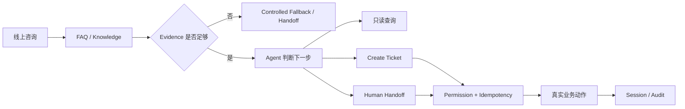
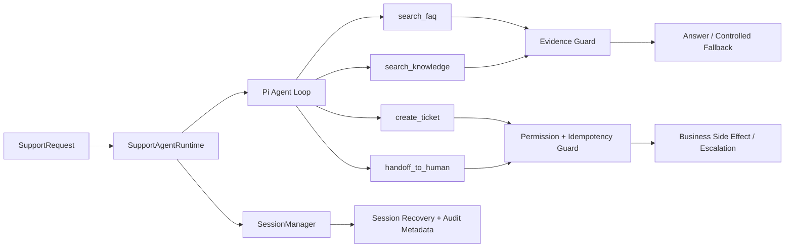

# 数字前台 Agent · Support Runtime V0

> **面向小型门店 / 服务型商家的线上第一接待 Agent Runtime 工程切片。**  
> 从“能聊天”继续推进到 **有依据地回答、受控地调用工具、真实地记录业务动作、必要时稳定转人工**。

**当前状态：Runtime V0 已冻结｜41 / 41 Tests PASS｜Build / Type Check / Clean Install PASS**

---

## 30 秒看懂这个项目

这个仓库不是完整 CRM，也不是一个通用 Chatbot。它是“数字前台 Agent”里的 **核心 Runtime V0**，重点验证 Agent 真正进入业务流程之前最容易出问题的边界。

| 招聘官关心的问题 | 这个仓库给出的工程回答 |
| --- | --- |
| 模型为什么可以回答？ | FAQ / Knowledge 必须有可验证 Evidence；没有依据就 fail closed |
| 模型说要创建 Ticket，就能执行吗？ | 不能。写操作必须经过服务端 Permission / Scope 判断 |
| 模型说“已完成”，业务动作真的完成了吗？ | 文本不等于业务状态；副作用必须由 Tool 真正执行 |
| 并发调用会不会重复创建？ | Ticket / Handoff 有幂等与 reservation，阻止重复和 race |
| Provider / Tool 卡住怎么办？ | Agent / Tool Budget + Overall / Per-tool Timeout + cancellation |
| 多轮恢复会不会串租户 / 串用户？ | Session 恢复时校验 tenant / store / customer identity |
| 这些机制怎么证明？ | 41 个自动化测试 + 独立安装验证 + 架构 / Test Report |

---

## 它解决的不是“聊天”，而是这一条业务链



V0 聚焦四类受控业务 Tool：

- `search_faq`
- `search_knowledge`
- `create_ticket`
- `handoff_to_human`

其中前两类只读；后两类有副作用，必须经过权限、幂等和安全边界控制。

---

## 为什么要做这个 Runtime

做客服 / 数字前台 Agent 时，真正困难的不是生成一句自然语言，而是几个更实际的问题：

1. **Retrieval ≠ Answer Authorization**  
   检索到内容，不代表当前租户 / 门店 / 场景就可以据此回答。

2. **LLM Proposal ≠ Server Authorization**  
   模型可以提出“创建 Ticket / 转人工”，但不能自行获得业务权限。

3. **Text ≠ Business State**  
   模型文本里的“已退款 / 已取消 / 已完成”不能替代真实业务动作。

4. **Agent 不能无限执行**  
   Provider、Tool、Retrieval 都可能超时或失败，需要明确 Budget、Timeout 与 fallback。

5. **Session 必须绑定身份**  
   多轮上下文恢复不能绕过 tenant / store / customer 的身份一致性。

因此 V0 先把下面这条最小闭环做正确：

**Evidence → Decision → Authorized Tool → Side Effect / Handoff → Session / Audit**

---

## Recruiter Quick View

这个仓库主要证明 5 类能力：

| 能力 | 可验证工程证据 |
| --- | --- |
| **Agent Runtime** | 基于公开 Pi Agent API 运行真实 Agent loop，而不是手写模拟状态机 |
| **Evidence-first** | FAQ / Knowledge 没有可靠 Evidence 时 fail closed，不允许模型猜业务事实 |
| **Tool / Authority** | 写操作由服务端权限控制，LLM 只能提出动作，不能直接获得授权 |
| **Safe Side Effects** | Ticket / Handoff 使用 strict schema、幂等和并发 reservation |
| **Quality Gate** | 41 个自动化测试覆盖 runtime、session、权限、超时、fallback、race 与 extraction independence |

---

## Runtime 架构



核心原则：

- **Retrieval ≠ Answer Authorization**：没有经过验证的 FAQ / Knowledge Evidence，不输出业务事实答案。
- **LLM Proposal ≠ Server Authorization**：Ticket / Handoff 在 Tool 执行前检查权限。
- **Text ≠ Business State**：模型文本不能单独证明“已退款 / 已取消 / 已完成”等副作用已经发生。
- **Fail Closed**：Evidence 缺失、Tool 失败、权限不足、超时、Agent / Tool Budget 达上限时，返回受控 fallback 或人工升级。
- **Identity Bound Session**：同一 conversation 恢复时校验 tenant / store / customer，避免跨身份复用 Session。

---

## 关键工程机制

### 1. Evidence Guard

`search_faq` 与 `search_knowledge` 都是只读 Tool。

Runtime 会记录当前 turn 是否得到经过验证的 Evidence；如果模型回答包含营业、退款、预约、订单、价格、政策等业务事实，但没有 Evidence 支撑，则直接 fallback。

这解决的是：

> **“检索到了内容”不等于“当前可以回答”。**

### 2. Tool / Authority

当前有副作用的 Tool：

- `create_ticket`
- `handoff_to_human`

执行前由 Runtime 检查：

- Ticket：`tickets:write`
- Handoff：`handoff:write` + `mayEscalate`

Tool 参数全部使用 TypeBox strict schema，拒绝额外字段。

这解决的是：

> **模型负责理解和提出动作；最终业务授权由服务端控制。**

### 3. Idempotency & Concurrency

Ticket 使用 `tenantId + idempotencyKey` 防重复；Ticket 与 Handoff 都增加 reservation，避免并发调用在真正写入前出现 race condition。

这解决的是：

> 同一个 Agent turn / 并发请求不能因为重复 Tool Call 产生重复业务动作。

### 4. Runtime Budget & Timeout

默认约束：

- Agent turns：4
- Tool calls：6
- Overall turn timeout：10s
- Per-tool timeout：2s

Timeout 使用 `AbortSignal` 向 Retrieval / Tool 传播取消，并隔离 late events，避免超时以后继续产生不可控副作用。

### 5. Session & Audit

通过 Pi `SessionManager` 保存 / 恢复上下文，并额外写入 `support-agent.audit`：

- outcome
- toolsCalled
- turns
- toolCalls
- timedOut
- limitReached
- escalationRequested
- toolFailed

Runtime 不只返回“答案”，也保留一次 Agent 执行为什么结束的审计信息。

---

## 自动化验证

当前验证结果：

```text
Vitest: 41 / 41 PASS
Build: PASS
Biome + Type Check: PASS
Clean install verification: PASS
```

覆盖范围：

- Session recovery / identity consistency
- 4 个业务 Tool 的 schema 与执行
- Tool permission guard
- Ticket / Handoff 幂等与并发 race
- Agent / Tool budget
- Overall / per-tool timeout 与 cancellation
- Provider failure fallback
- Empty / unsafe model output guard
- No-evidence / FAQ hallucination guard
- Audit persistence
- Extraction independence / exact dependency pins

验证命令：

```bash
npm ci
npm test
npm run build
npm run check
```

详细结果见 [TEST_REPORT.md](docs/support-agent/TEST_REPORT.md)。

---

## 技术栈

- **TypeScript / Node.js 22+**
- **Vitest**
- **TypeBox**
- **Biome**
- **Pi Agent Core / Pi AI / Pi Coding Agent**
- **JSONL Session persistence（Pi SessionManager）**

依赖固定在明确版本，不使用 floating branch / tag，也没有 vendored Pi core 源码。

---

## 仓库结构

```text
src/
  index.ts                         # Runtime、4 个业务 Tool、guards、session / audit

skills/
  appointment/
  complaint/
  escalation/
  greeting/
  refund/                          # 产品侧业务 SOP / Skill

tests/
  support-agent-runtime.test.ts    # V0 runtime 主测试集
  extraction-independence.test.ts  # 独立仓库与依赖边界验证

docs/
  support-agent/
    ARCHITECTURE.md
    CURRENT_STATE.md
    TEST_REPORT.md
  architecture/
    PI_INTEGRATION.md
  extraction/
    EXTRACTION_MANIFEST.md
    EXTRACTION_GATE_REPORT.md
```

---

## 当前边界

这个仓库是一个**刻意收敛的 Runtime V0**。

当前没有声称已经实现：

- Vector DB / Embedding RAG
- UI / Web / Mini Program
- CRM / ERP 等真实企业系统集成
- 多 Agent orchestration
- 真实客户生产部署
- Production SLA / 大规模流量验证

这些不是 README 遗漏，而是当前工程事实边界。

V0 的目的，是先把 Agent 进入真实业务流程之前最容易出问题的 **Evidence、Authority、Side Effect、Session、Timeout 与 Audit** 做成可测试、可审查的工程基线。

---

## 延伸阅读

- [Runtime Architecture](docs/support-agent/ARCHITECTURE.md)
- [Current State](docs/support-agent/CURRENT_STATE.md)
- [Test Report](docs/support-agent/TEST_REPORT.md)
- [Pi Integration](docs/architecture/PI_INTEGRATION.md)
- [Extraction Manifest](docs/extraction/EXTRACTION_MANIFEST.md)
