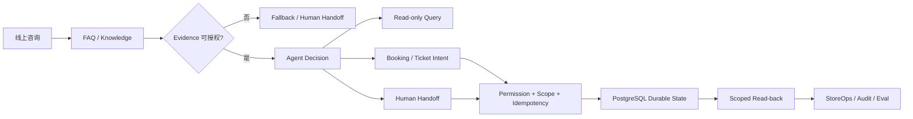

# 数字前台 Agent

> **面向小型门店 / 服务型商家的线上第一接待 Agent。**  
> 目标不是做一个“会聊天的 Bot”，而是把 **Knowledge / FAQ、预约意向、Ticket / Handoff、人工跟进** 放进一条可控、可验证、可交付的业务链。

**Current state：Pre-ICP Engineering Baseline — CLOSED / FROZEN**  
**Main 已集成：Agent Runtime · Authority · Governed Knowledge · Durable State · Eval / Harness · React · PostgreSQL · FastAPI / pgvector · Docker**  
**当前不声称：Production Ready · 真实客户部署 · Hosted Embedding PASS · Retrieval Quality Acceptance · Live WeCom**

---

## 30 秒看懂

如果一个 Agent 真要进入业务流程，最难的不是“回答一句话”，而是下面这些问题：

| 业务 / 工程问题 | 当前实现 |
| --- | --- |
| **它凭什么回答？** | FAQ / Knowledge 先经过 approval、version、source reference、tenant / store scope admission |
| **模型说要执行动作，就真的能执行吗？** | 不能；identity、membership、capability、scope 与写权限由服务端决定 |
| **Tool Call 就等于业务成功吗？** | 不等于；Ticket / Handoff 必须持久化，并通过 scoped durable read-back 验证 |
| **不同租户 / 门店会不会串数据？** | tenant / store authority + PostgreSQL isolation + server-derived session |
| **Agent 出错、超时、证据不足怎么办？** | fail closed、bounded runtime、controlled fallback / handoff |
| **版本改了以后怎么知道是变好还是变坏？** | Safety / Knowledge / Retrieval / Harness regression + CI Gate |
| **Demo 怎么走向可交付？** | React + Node + PostgreSQL + Docker；private FastAPI / pgvector 作为受控 Candidate Evidence service |

一句话概括：

> **Evidence 决定“能不能说”，Authority 决定“能不能做”，Durable State 决定“有没有真的发生”，Eval 决定“改完以后是不是真的更好”。**

---

## 产品闭环

数字前台聚焦的是线上第一接待，而不是替代完整 CRM。



当前工程验证的核心链路：

**线上咨询 → Governed Evidence → Agent Decision → Authorized Tool → Durable Ticket / Handoff → StoreOps / Audit → Eval / Regression**

---

## Recruiter Quick View

这个仓库主要证明的不是某一个框架，而是下面 8 类能力。

| 能力 | 可验证工程证据 |
| --- | --- |
| **Agent Runtime** | Pi-owned Agent loop、受控业务 Tools、turn / tool budget、timeout / cancellation |
| **Request Traceability** | server-side `requestId` 贯穿 HTTP → execution context → Runtime → audit |
| **AgentProfile Governance** | 服务端版本化 Profile + canonical hash，约束 Skills / Tools / identity-work policy，mismatch fail closed |
| **Evidence-first** | Governed FAQ / Knowledge admission；0 / 1 / 2+ answerability；没有合法 Evidence 时 fail closed |
| **Tool / Authority** | identity、membership、capability、tenant/store scope 全部由服务端解析，LLM 不直接拥有写权限 |
| **Durable Acceptance** | 模型文本 / Tool claim 不作为成功证明；Ticket / Handoff 需要 PostgreSQL scoped read-back |
| **Eval / Quality Gate** | Safety、blind holdout、Knowledge、Retrieval、Harness regression；既有 evaluator 保持 PASS / FAIL authority |
| **Delivery / Integration** | React + Node + PostgreSQL + Docker；private FastAPI / pgvector deterministic cross-language integration |

---

## 关键设计判断

### 1. Retrieval ≠ Answer Authorization

“检索到了”不代表“当前可以回答”。

FAQ / Knowledge 会经过：

- approval lifecycle
- version
- source reference
- tenant / store scope
- synthetic / test admission boundary

普通 Knowledge 使用明确的 **0 / 1 / 2+** 路由：

- **0** 个 admissible candidate → fallback
- **1** 个 canonical candidate → answer eligible
- **2+** candidates → ambiguous / fallback

---

### 2. LLM Proposal ≠ Server Authorization

模型可以理解用户意图，也可以提出下一步动作，但不能自己获得业务权限。

服务端负责：

- identity / membership
- capability
- tenant / store authority
- Ticket / Handoff permission
- business write

也就是说：

> **LLM 负责理解与提议，Server 负责授权与提交。**

---

### 3. Tool Call ≠ Durable Business Success

模型说“已创建工单”或者 Tool 返回一次成功，不足以证明业务状态真的成立。

关键动作按下面的链路验证：

**authorize → write → persistence → scoped read-back → acceptance**

同时保留：

- idempotency
- duplicate / race protection
- tenant / store isolation
- safe audit projection

这也是 Harness 的核心判断之一：**模型 / Tool 声称成功，不等于最终业务结果成功。**

---

### 4. Runtime 必须有边界

当前 Runtime 保留明确预算：

- Agent turns：**4**
- Tool calls：**6**
- Overall turn timeout：**10s**
- Per-tool timeout：**2s**

Provider failure、Tool failure、Evidence failure、权限不足、Timeout 都进入 bounded failure path，而不是让 Agent 无限继续执行。

---

### 5. Eval 不是“修掉一个 Badcase”

质量链路按：

**Case / Config → Runtime → Evaluation → Report → Gate → Version Decision**

当前保留：

- Safety vertical slice
- **100-case** robustness evaluation
- **60-case** blind holdout
- Governed Knowledge evaluation
- Retrieval regression
- Thin Evaluation Harness
- Durable Acceptance
- Regression matrix / governance manifest

Pre-ICP consolidation 只增加可解释性与回归可见性，**不制造一个虚假的 blended Agent score**。

---

## 一个实际的工程 Trade-off

Semantic Evidence Selector 做过真实模型、unseen holdout、order robustness 与 latency characterization。

历史 30 次 latency observation：

- P50 ≈ **7.35s**
- P95 ≈ **16.67s**

在当前 Runtime 的 **10s overall / 2s per-tool** 预算下，它不适合作为同步主路径依赖，因此没有被硬塞进 Runtime。

这个项目保留 FAILED / BLOCKED / DEFERRED 证据的原因很简单：

> **技术方案不是越复杂越好；只有通过质量、时延和业务边界验证，才进入主链。**

---

## 当前主干已经集成什么

当前 `main` 是唯一的 **Pre-ICP Engineering Baseline**，不再只是早期 V0 Runtime。

已收口能力包括：

- Agent Runtime
- server-derived Authority / RBAC / tenant-store scope
- Request Debugging / requestId
- AgentProfile
- Governed FAQ / Knowledge
- PostgreSQL durable Ticket / Handoff / Audit
- Durable Acceptance / Harness
- React StoreOps surface
- Docker / Compose delivery proof
- Python 3.11 / FastAPI private retrieval service
- PostgreSQL 16 / pgvector deterministic integration
- Node ↔ Python canonical reconciliation
- Safety / Knowledge / Retrieval / Harness CI Gates
- Evaluation Governance Consolidation

### 当前技术栈

**Agent / Backend**  
TypeScript · Node.js · Pi Agent Core / Pi AI · TypeBox

**Product Surface**  
React

**Data / Retrieval**  
PostgreSQL 16 · pgvector · Python 3.11 · FastAPI · Pydantic · psycopg

**Quality / Delivery**  
Vitest · Eval Harness · GitHub Actions · Docker / Compose

---

## 验证证据

### 当前 Pre-ICP Frozen Source

- Source commit：`55182eb11e801b49a5c5564d05acc72207b249f1`
- Source tree：`68499338168aed05353247ce5196503b7118bcf7`
- Clean-runner：`35238937264`
- Job：`105262039153`
- Conclusion：**PASS**

该 baseline 在 Job-Search Sprint 之上进一步关闭：

- Request Debugging
- Durable Acceptance
- Thin Digital Employee / AgentProfile
- Pre-ICP Evaluation Governance Consolidation V1

### 历史 Job-Search Sprint V1

- Final closure baseline：`0a2d0f723814eb787e079195dc4326a944c1fd76`
- Final clean-runner：`34766236491`
- Conclusion：**PASS**

历史 clean-runner 覆盖：

- PostgreSQL Identity / Business / Application
- Core A / Core B PostgreSQL gates
- tenant / store isolation
- Python RAG：**43 / 43**
- vector-postgres cross-language E2E
- React application
- Docker build / start / persistence
- build / check / integrity
- Safety / Knowledge / Retrieval evaluation suites

> **Deterministic vector / pgvector / FastAPI / Node integration PASS 证明的是集成正确性，不等于 hosted embedding 或 semantic retrieval quality 已通过验收。**

---

## RAG / FastAPI 的边界

Python 服务在当前架构里是一个 **private Candidate Evidence service**。

它可以：

- 接收严格受控的检索请求
- 在 tenant / store / version / profile 范围内返回候选 Evidence
- 通过 PostgreSQL / pgvector 完成 deterministic integration
- 向 Node 返回可校验 metadata

它不能：

- 自己批准 Knowledge
- 扩大 tenant / store scope
- 改变业务权限
- 直接修改 Ticket / Handoff
- 自己决定最终回答

最终 Evidence admission 与业务 Authority 仍由 Node 侧控制。

---

## 仓库结构

```text
src/
  index.ts                    # Agent Runtime / Tools / Guards
  enterprise/                 # identity / authority / business / HTTP / PostgreSQL

web/                          # React StoreOps / product surface
ai-service/                   # private FastAPI Candidate Evidence service
migrations/                   # PostgreSQL schema / ledger / RAG profile
evals/                        # Safety / Knowledge / Retrieval evaluation
harness/                      # evaluation / acceptance contracts
skills/                       # product-owned business Skills
tests/                        # runtime / enterprise / PostgreSQL / integration tests
scripts/                      # Docker / Gate / delivery verification
docs/                         # architecture / current state / evidence / decisions
Dockerfile
compose.yaml
```

---

## 当前边界 / 下一阶段

已经完成的是 **Pre-ICP Engineering Baseline**。

当前仍然明确不声称：

- Production Ready
- 真实客户部署 / Pilot 已验收
- public HTTPS / ICP 后公网部署
- Live WeCom protocol / identity wiring
- Production Data Flywheel
- Production SLA / 大规模真实流量
- Hosted OpenAI Embedding PASS
- Semantic / Vector Retrieval Quality Acceptance
- Hybrid / RRF 已实现
- Reranker 已上线
- MCP 已进入当前产品主链
- 复杂 CRM / ERP 生产集成

当前工程状态对应的下一阶段是：

**ICP / Public Deployment → Live Channel Integration → Real Customer POC → Real Traffic / Badcase → Production Evaluation Loop**

---

## 如何审这个项目

如果你是招聘官 / 面试官，建议按这个顺序：

1. **先看本 README**：理解业务问题、系统边界与核心 Trade-off。
2. 看 [Job-Ready Current State](docs/job-ready/CURRENT_STATE.md)：确认当前事实、Gate 与未完成项。
3. 看 `src/index.ts`：Agent Runtime、Tools、Evidence / Authority Guard。
4. 看 `src/enterprise/`：Identity、Scope、Persistence 与 HTTP boundary。
5. 看 `harness/` 与 `evals/`：Eval / Acceptance 是怎么做的。
6. 看 `ai-service/`：FastAPI / pgvector Candidate Evidence service。
7. 看 GitHub Actions：确认 PostgreSQL / Python / Node / Docker / Eval Gate 是真实执行过的。

---

## 历史 / 实验分支为什么还保留

`main` 只代表**已收口、已验证的当前工程事实**。

历史分支用于保留：

- 架构演进
- failed / blocked experiments
- semantic selector / latency characterization
- 独立阶段 Gate
- successor work

它们不是第二个“当前版本”，而是回答一个更有价值的问题：

> **为什么最后选择了现在这套架构，而不是别的方案？**
